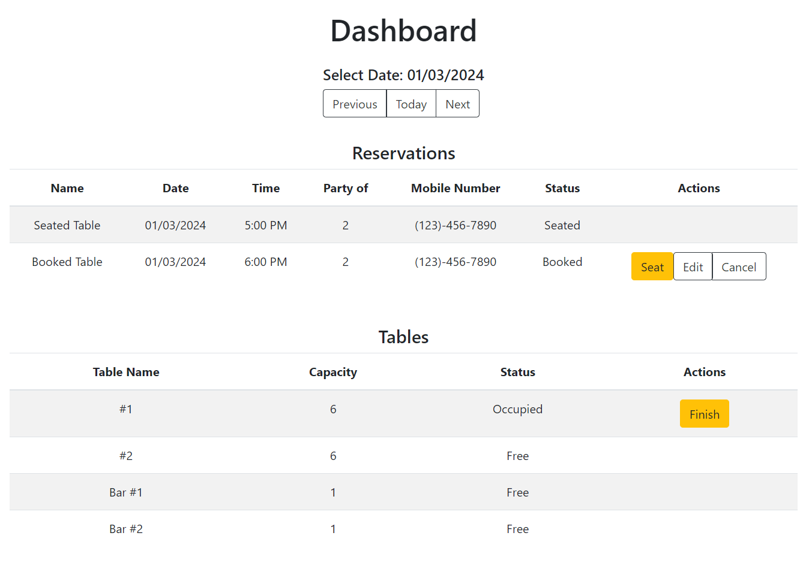
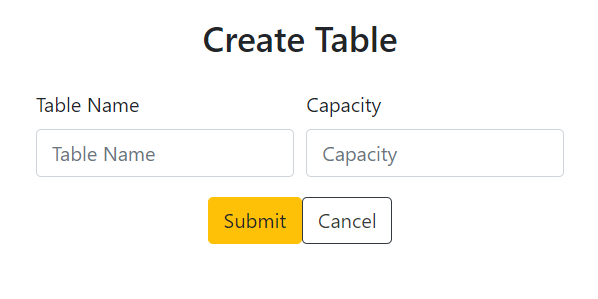
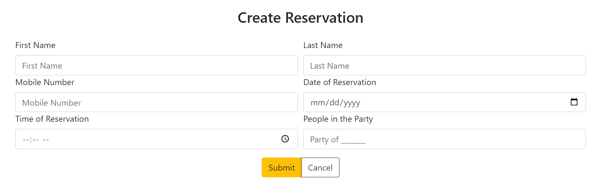
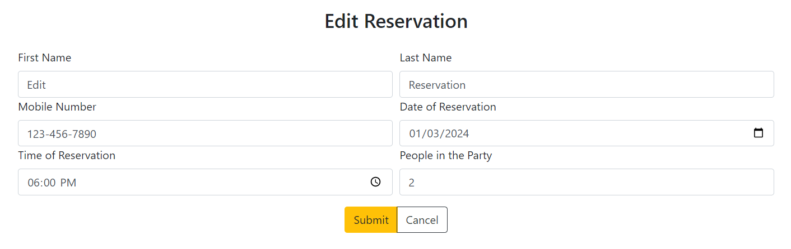
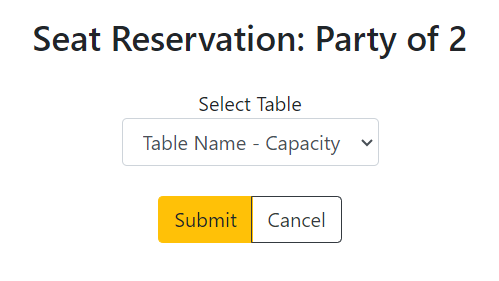

# Restaurant Reservation App
This is my final capstone project as part of the Thinkful Bootcamp course. This full-stack web app is designed to assist restaurants in managing reservations and tables.

#### Assignment:
> You have been hired as a full stack developer at _Periodic Tables_, a startup that is creating a reservation system for fine dining restaurants.
> The software is used only by restaurant personnel when a customer calls to request a reservation.
> At this point, the customers will not access the system online.

#### Technologies:
Built with React, Node.js, Express, and PostgreSQL 
Styled with Bootstrap

#### Github:
Visit the [GitHub Repository](https://github.com/kylemcguire35/restaurant-reservation-app/){:target="_blank"} for the latest code and updates.

#### Deployed Versions:
- [Vercel Deployment](https://restaurant-reservation-frontend-nine.vercel.app/dashboard){:target="_blank"}
- [Render Deployment](https://restaurant-reservation-frontend-pei3.onrender.com/dashboard){:target="_blank"}

## Table of Contents
- [App Summary](#app-summary-with-screenshots)
- [API Documentation](#api)
- [Installation](#installation)
- [Knex](#knex)

## App Summary
### Dashboard
The Dashboard page lists all tables and reservations on a selected date.

#### Select Date:
Choose your date by clicking the `Previous`, `Today`, and `Next` buttons.

#### Reservations List:
The Reservations List will show every booked or seated reservation. 
Reservations that have been finished or cancelled will not be shown. 
Booked reservations will display `Seat`, `Edit`, and `Cancel` buttons.

#### Tables List
The Tables List will show every table in order by table name. 
Occupied tables will display a `Finish` button that will finish a reservation and re-open the table.

### Create Table
The Create Table page displays a form to create a new table.

#### Validators:
- Table name must be at least 2 characters long. 
- Capacity must be at least 1.

### Create Reservation
The Create Reservation page displays a form to create a new reservation.

#### Validators:
- All fields must be filled. 
- Mobile number must be 10 digits long. 
- Date cannot be a past date. 
- Date cannot be a Tuesday (restaurant closed on Tuesdays). 
- Time cannot be a past time. 
- Time must be between 10:30AM and 9:30PM. 
- People in party must be at least 1.

### Edit Reservation
The Edit Reservation page allows you to edit an existing reservation.

#### Validators:
- Same validators as `Create Reservation`.

### Seat Reservation
The Seat Reservation page dislays a form to select a table to occupy. 
You cannot seat at a table that is already occupied.

### Search
The Search page allows you to search for reservations by mobile number. 
You do not need a full mobile number to search.

## API
| Request | Path                                 | Description                                                 |
| ------- | ------------------------------------ | ----------------------------------------------------------- |
| GET     | /reservations?date                   | list all reservations by date, sorted by time               |
| GET     | /reservations?mobile_number          | list all reservations by mobile number, sorted by time      |
| POST    | /reservations                        | create new reservation                                      |
| GET     | /reservations/:reservationId         | read reservation by reservation_id                          |
| PUT     | /reservations/:reservationId         | update reservation by reservation_id                        |
| PUT     | /reservations/:reservationId/status  | update reservation status by reservation_id                 |
| GET     | /tables                              | list all tables, sorted by table name                       |
| POST    | /tables                              | create new table                                            |
| PUT     | /tables/:tableId/seat                | seat table and assign it a reservation_id                   |
| DELETE  | /tables/:tableId/seat                | finish a table and remove the reservation_id assignment     |

## Installation
1. Fork and clone this repository.
1. Run `cp ./back-end/.env.sample ./back-end/.env`.
1. Update the `./back-end/.env` file with the connection URL's to your database instance. 
1. Run `cp ./front-end/.env.sample ./front-end/.env`.
1. You should not need to make changes to the `./front-end/.env` file unless you want to connect to a backend at a location other than `http://localhost:5001`.
1. Run `npm install` to install project dependencies.
1. Run `npm run start:dev` to start your server in development mode.

## Knex
Once the database is set up, run `npx knex` commands from within the `back-end` folder, which is where the `knexfile.js` file is located.

#### Note:
There are 4 environments in the backend: 
Production, Development, Test, and Preview.

It is best to run knex commands for each environment separately. 

#### Example:
"npx knex migrate:latest --env development" 
"npx knex seed:run --env development"
